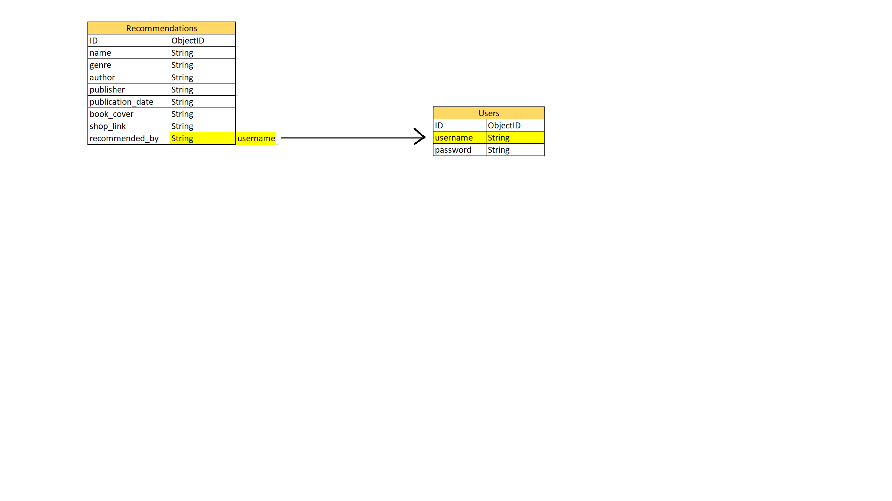

# BookReviews

Enjoy reading, BookReviews can help you find the book you like. 

## How It Works

By logging in users can see recommendations books and recommend book on BookReviews.

<a name="demo"></a>

## Demo

You visit BookReviews right away by clicking
[here](https://bookreviews-heroku.herokuapp.com/)
</img>

## Database design
</img>

## User Experience (UX)
To make the web simple for the user to understand and to give necessairy information about how to use the web and about the book provided.

- ### Users
    -   #### New user Goals
        1. As a new user, I want to know what the web is.(BookReviews/home)
        2. As a new user, I want register an account.(register)
        3. As a new user, I want to look for recommendations books provides by BookReviews. (recommendations)

    -   #### Returning user Goals.
        1. As a returning user, I would like to be able to edit or delete any content added by me.

    -   #### Frequent user Goals
        1. As a frequent user, I want to log in my account. (account)
        2. As a frequent user, I want to views book on multiple device. (responsive)
        3. As a frequent user, I want to recommend book. (recommendations)
        4. As a frequent user, I want to check my recommended books. (profile)

- ### Owners
    1. As a owner, I want my website to be preferable and accessible.
    2. As a owner, I want to earn money on each book purchased via a link from the site.

-   ### Design
    -   #### Colour Scheme
        *   Main color used are shade of orange, yellow, blue, black and white (the Colour Scheme is provide by bootsrap theme)
    -   #### Typography
        *   I use Merriweather with Sans Serif for all contents in this game. (the Typography is provide by bootsrap theme)

## Features

* Allow user to view on multiple device
* Allow user register, log in and log out his/her account
* Allow user to understand how to use and what the BookReviews provides.
* Allow user to go direly to a web (Amazon.com) where user can buy the book.
* Allow user to recommend book

### Future features
1. Reviews - Allow user write reviews

<a name="browsersuport"></a>
## Browser support

-   ### The browser version that fully supports.
    * Chrome *(36.0)*
    * Edge *(10.0)*
    * Firefox *(16.0)*
    * Opera *(23.0)*
    * Safari *(9.0)*

##  Code
- My theme is taken from this website. [Startbootstrap creative](https://startbootstrap.com/theme/creative)
- I also inspired certain way to code from Code Institute. [Acknowledgements](#Ack)

## Testing
-   [W3C Markup Validator](https://validator.w3.org/) - [Results](validator/homepage.png)

### Testing User Stories from User Experience (UX) Section
-   #### New user Goals
    1. As a new user, I want to know what the web is.(BookReviews/about) - PASS
        * By clicking on BookReviews user can see information of BookReviews.

    2. As a new user, I want register an account.(register) - PASS
        * User can register an account, data will be stored in mongoDB's Database (users)

    3. As a new user, I want to look for recommendations books provides by BookReviews. (recommendations) - PASS
        * In BookReviews's recommendations page user can see all the book in BookReviews's Database.

-   #### Returning user Goals.
    1.  As a returning user, I would like to be able to edit or delete any content added by me. - PASS
        * Edit and delete button appear.
        * Reviews information from each book will also be shown.
        
        
-   #### Frequent user Goals
    1. As a frequent user, I want to log in my account. (account)  - PASS
        * user can log in his account if he has already registered.

    2. As a frequent user, I want to views book on multiple device. (responsive)  - PASS
        * Each device have its own style which make the web responsive. So user can view on a mobile phone or a computer.
        * Click [here](#demo) to see how does the responsive look like.

    3. As a frequent user, I want to recommend book. (recommendations) - PASS
        * By clicking on recommended button, the recommended count will be increased.
        * User must login before to recommend book.
        * User can recommend the same book once per account.

    4. As a frequent user, I want to check my recommended books. (profile)  - PASS
        * After logging in BookReviews users are able to check their profile which displays book(s) that this user accout added to BookReviews recommendations.

### Features Testing
* Edit and Remove buttons appear correctly if the book is added by the logged in account.
* Form fields is validated by type (text, url, date)
* Books which are added by logged in account appears in profile page.
* Users are able to Edit, Add, Remove books which are added by themself on the website after logging in.

### Further Testing
* Registered account stores in mongoDB. [MongoDB](https://www.mongodb.com/)
* Every button has the same style to increase the look and feel of user when changing pages.
* All links were tested. Internal links all work. External links all work and open in new window.
* The data displayed correctly, all buttons link to a correct destination.
* All the pages are responsive on all screen sizes.

### Bugs
#### Fixed
* Add book doesn't display correctly on mobile (responsive fixed)
* Footer is always on the bottom of the web. (add 100vh for body content)

## Strategy

The goal in the design was to make it as easy as possible for non experience user to be able understand. User can find all needed information about the book from BookReviews.

## Technologies

**Languages:**
* [HTML5:](https://www.w3schools.com/html/default.asp)
    - HTML5 was used to code the content of the website.
* [CSS:](https://www.w3schools.com/css/default.asp)
    - CSS3 was used to style the content.
* [JavaScript:](https://www.w3schools.com/js/default.asp)
    - JavaScript was used to style the significant interactive functionality.
* [Python:](https://www.w3schools.com/python/default.asp)
    - Python was used for the project back-end functions. Flask and Python is used to build route functions.

**Tools and Libraries:**
* [W3C Validator:](https://validator.w3.org/)
    - The W3C Markup Validator and W3C CSS Validator Services were used to validate every page of the project to clear syntax errors.
* [Font-Awesome:](https://fontawesome.com/)
    - Font Awesome was used on all pages throughout the website to add icons for aesthetic and UX purposes.
* [Flask:](https://flask.palletsprojects.com/)
    - web application framework used to create functions with Python that are injected into html templates. 
* [jQuery:](https://jquery.com/)
    - jQuery library was used to simplify the JavaScript.
* [HTML and CSS Beautifier:](http://minifycode.com/html-beautifier/)
    - HTML and CSS was used to format the codes to make it more readable.
* [JSHint](https://jshint.com/) 
    - Used to test/validate JavaScript Code.
* [PEP8 Online Checker:](http://pep8online.com/)
    - P8P was used to verify that python coding conventions were applied to meet requirements.
* [figma:](https://www.figma.com/)
    - Diagram software used to create the database schema and data manipulation operations diagrams.
* [Git:](https://git-scm.com/)
    - Git was used for version control by utilizing the Gitpod terminal to commit to Git and Push to GitHub.

## Structure

The navigation bar is structured to get the right information as quickly as possible. The website itself is structured in hope of user feels ease while viewing and the database is also structured in order and in a clear way.

## Known Issues
* Unable to define if users provide the correct informations
* If book_cover is a wrong link the image will not be displayed

## Deployment
This site was developed on GitPod, using Git and GitHub to host the repository as we cannot host a Python project on GitHub Page which only allows for static websites. Git was used for version control by utilizing the Gitpod terminal to commit to Git and Push to GitHub.

Note: It's important to contained our environment variables within a hidden env.py file which should never be pushed to GitHub by ensuring .gitignore has it secured.
### `How to open this project`
1. Copy this link "https://bookreviews-heroku.herokuapp.com/"
1. Paste and open on a browser

### `How to open this project localy`

1. Open Milestone_Project_1 on Github
1. Download as a ZIP file
1. Extract the folder
1. Open Memo-flag folder
1. Run index.html file on a web browser such as Firefox or Chrome

### `How to make a Local Clone`

1. Log in to GitHub and locate the [GitHub Repository](https://github.com/)
1. Under the repository name, click "Clone or download".
1. To clone the repository using HTTPS, under "Clone with HTTPS", copy the link.
1. Open Git Bash
1. Change the current working directory to the location where you want the cloned directory to be made.
1. Type `git clone`, and then paste the URL you copied in Step 3.
1. Type this then Press Enter. Your local clone will be created.
```
$ git clone https://github.com/YOUR-USERNAME/YOUR-REPOSITORY
```

```
$ git clone https://github.com/YOUR-USERNAME/YOUR-REPOSITORY
> Cloning into `CI-Clone`...
> remote: Counting objects: 10, done.
> remote: Compressing objects: 100% (8/8), done.
> remove: Total 10 (delta 1), reused 10 (delta 1)
> Unpacking objects: 100% (10/10), done.
```

Click [Here](https://help.github.com/en/github/creating-cloning-and-archiving-repositories/cloning-a-repository#cloning-a-repository-to-github-desktop) to retrieve pictures for some of the buttons and more detailed explanations of the above process.

## Heroku

By using Heroku platform for BookReviews, the following steps were taken:

### Create A Heroku App

* Navigated to [Heroku.com](https://www.heroku.com/) in web browser. Once there, clicked on "Sign Up" and created a new account.
* Chose 'Python' as Primary Development Language.
* Selected "**Create new app**" from the Heroku dashboard.
* Filled in the unique app name on the form and selected corresponding region, then clicked on "**Create app**"

### Install Heroku CLI

I used the Heroku command-line interface, within the Terminal:

* `npm install -g heroku` - to install Heroku  
* Type: `heroku login -i` then login to created account

### Connect Git remote

we can either link our local Git repository with Heroku, or setup Automatic
Deployment from GitHub.

To link the local Git repository to Heroku:

* `git status` - to check the current state of the repository.
* `git init` - to initialize empty repository (If repository not created already)
* `git add -A` - to add all the files to staging area.
* `git commit -m "Deployment to Heroku"` - to commit changes.
* `git push -u heroku main` - to push code directly to Heroku.

### Adding A requirements.txt File

To add the list of Python dependencies that the project needs in order to run successfully and detect the language:

* `pip3 freeze --local > requirements.txt` - command in the terminal to create a requirements.txt file, 
* `git add -A` - to add what will be commited
* `git commit -m "Add requirements.txt"` - to commit changes.
* `git push -u heroku main` - to push file to Heroku.

### Adding A Procfile

To inform Heroku on how to run the application and which file runs it the **Procfile** was installed:

* `echo web: python app.py > Procfile` - with a capital 'P' command in the terminal to redirect the echo command.
* `git add Procfile` 
* `git commit -m "Add Procfile` 
* `git push`

## Credits
- ### Content

* Inspiration and base code was derived from the Mini Project section of the [Code Institute](https://courses.codeinstitute.net/) course.
Code was modified to better fit my needs. 

## Content
* Book's informations are based on two main sources, namely [Amazon](https://www.amazon.com/) and [Wikipedia](https://www.wikipedia.org/).

<a name="Ack"></a>
-   ### Acknowledgements
    * Inspiration and base code was derived from the Mini Project section of the [Code Institute](https://courses.codeinstitute.net/) course.
Code was modified to better fit my needs.
    * Special thanks to my mentor Oluwafemi Medalen for supporting me during the project
